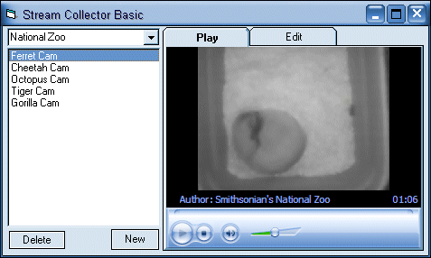



## Stream Collector Basic

### Description

No matter what kind of streaming media your into, this program is bound to become your best friend. It uses a fully user programmable INI database to store and recall any streaming media that your into. Its capable of delivering eather audio or video, capable of even going full screen windowless video. Uses Windows Media Player 10. The next time you run into a hot webcam, radio stream or other media you now have a place to file it away for safe keeping. The programming focus was purely on functionality. I literally ripped this puppy out in one afternoon. Only possible limitations are users lack of ability to collect the streaming media links. Even though it only took one afternoon, it contains un-numerable hours studying the subject matter so it could be stored properly. Fully capable of being expanded upon to export XML or RSS. I sincerely hope everyone enjoys this baby !!!
 
### More Info
 

             |
---                |---
**Submitted On**   |2007-01-10 17:50:38
**By**             |[Thomas Swift](https://github.com/Planet-Source-Code/PSCIndex/blob/master/ByAuthor/thomas-swift.md)
**Level**          |Intermediate
**User Rating**    |5.0 (25 globes from 5 users)
**Compatibility**  |VB 6\.0
**Category**       |[Complete Applications](https://github.com/Planet-Source-Code/PSCIndex/blob/master/ByCategory/complete-applications__1-27.md)
**World**          |[Visual Basic](https://github.com/Planet-Source-Code/PSCIndex/blob/master/ByWorld/visual-basic.md)
**Archive File**   |[Stream\_Col2042051102007\.zip](https://github.com/Planet-Source-Code/thomas-swift-stream-collector-basic__1-67608/archive/master.zip)

